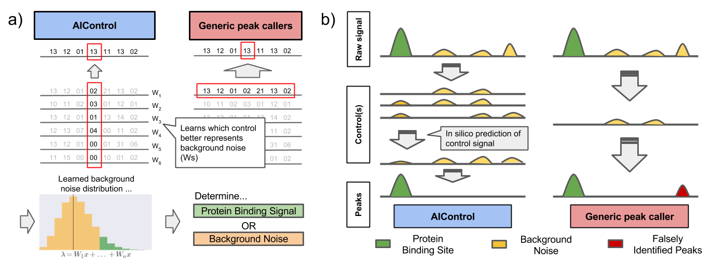
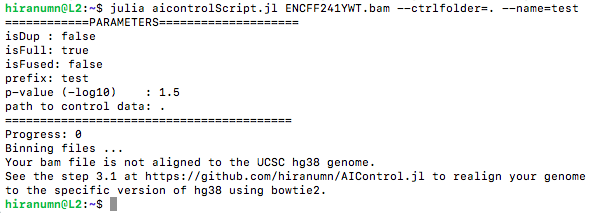

# AIControl.jl

[](https://travis-ci.org/suinleelab/AIControl.jl)

AIControl makes ChIP-seq assays **easier**, **cheaper**, and **more accurate** by imputing background data from a massive amount of publicly available control data.

Here is an overview of the AIControl framework from our paper. 


*Figure 1: (a) Comparison of AIControl to other peak calling algorithms. (left) AIControl
learns appropriate combinations of publicly available control ChIP-seq datasets to impute background
noise distributions at a fine scale. (right) Other peak calling algorithms use only one
control dataset, so they must use a broader region (typically within 5,000-10,000 bps) to estimate
background distributions. (bottom) The learned fine scale Poisson (background) distributions are
then used to identify binding activities across the genome. (b) An overview of the AIControl
approach. A single control dataset may not capture all sources of background noise. AIControl
more rigorously removes background ChIP-seq noise by using a large number of publicly available
control ChIP-seq datasets*

## Paper
We have an accompanying paper in BioRxiv evaluating and comparing the performance of AIControl to other peak callers in various metrics and settings. **AIControl: Replacing matched control experiments with machine learning improves ChIP-seq peak identification** ([BioRxiv](https://www.biorxiv.org/content/early/2018/12/26/278762)). You can find the supplementary data files and peaks files generated by the competing peak callers on [Google Drive](https://drive.google.com/open?id=1Xh6Fjah1LoRMmbaJA7_FzxYcbqmpNUPZ).

## Major Updates
- (12/14/2018) Cleared all deprecations. AIControl now works with Julia 1.0. Please delete the precompiled cache from the previous versions of AIControl. You may do so by deleting the `.julia` folder. 
- (12/15/2018) Updated some error messages to better direct users.
- (1/7/2019) Made AIControl Pkg3 compatible for Julia 1.0.3
- (1/24/2019) AIControl now writes everything to a folder by default. We also substatially improved the readme.md based on community feedback.
- (2/22/2019) Moved ownership to suinleelab from hiranumn

## Installation 
AIControl can be used on any **Linux** or **macOS** machine. While we tested and validated that AIControl works on **Windows** machines, we believe that it is easier for you to set up the AIControl pipeline on the Unix based systems.

AIControl expects a sorted `.bam` file as an input and outputs a `.narrowpeak` file. Typically, for a brand new ChIP-seq experiment, you start with a `.fastq` file, and you will need some external softwares to convert the `.fastq` file to a sorted `.bam` file. Thus, the whole AIControl pipeline needs the following sets of programs and packages installed on your local machine. We will explain how to install them in sections below.
- `Julia` (v1.0.3): for running Julia scripts
- `bowtie2` (2.3.4.3): for aligning a `.fastq` file to the hg38 genome
- `samtools` (1.9): for sorting an aligned bam file
- `bedtools` (v2.27.1): for converting a bam file back to a fastq file (OPTIONAL for Step 3.1)

### 1a. Installing Julia 1.0 for a Linux machine
The terminal commands below will install julia 1.0.3 (Long-term support release) on a linux machine. Please change the url accordingly. You can also download julia [here](https://julialang.org/downloads/). **[CAUTION:] We highly recommend avoiding the conda version of julia** as it currently known to have a problem locating libLLVM.so in many environments.
```
cd
wget https://julialang-s3.julialang.org/bin/linux/x64/1.0/julia-1.0.3-linux-x86_64.tar.gz
tar xvzf julia-1.0.3-linux-x86_64.tar.gz
echo  'export PATH=$PATH:~/julia-1.0.3/bin' >> ~/.bashrc
source ~/.bashrc
```

### 1b. Installing Julia 1.0 for a mac OS machine
Please first download the `.dmg` file of julia 1.0.3 (Long-term support release) for mac OS from the [julia website](https://julialang.org/downloads/), double-click to open it, and drag the icon to the Applications folder. Then, the following terminal command will put julia in your `PATH` and make it executable from the command line. **[CAUTION:] We highly recommend avoiding the conda version of julia** as it currently known to have a problem locating libLLVM.so in many environments.

```
echo 'export PATH="/Applications/Julia-1.0.app/Contents/Resources/julia/bin/:${PATH}"' >> ~/.bash_profile
source ~/.bash_profile
```
See [this](https://en.wikibooks.org/wiki/Introducing_Julia/Getting_started#On_macOS_X) for more troubleshooting. 

### 2. Installing Julia Packages
The terminal command below will install required julia packages and AIControl.
```
julia -e 'using Pkg; Pkg.add(["FileIO", "JLD2"]); Pkg.add(PackageSpec(url = "https://github.com/suinleelab/AIControl.jl")); using AIControl'
```

### 3. Installing external softwares with miniconda
Please download the bash installer of miniconda [here](https://conda.io/miniconda.html). The terminal commands below will a) make the bash installer executable, b)execute the bash installer, and c) install required external softwares using conda package management system.
```
chmod +x Miniconda2-latest-Linux-x86_64.sh #Change file name accordingly
./Miniconda2-latest-Linux-x86_64.sh  
conda install -c bioconda bowtie2 samtools bedtools
```

## Control data files required for AIControl
AIControl uses a massive amount of public control data for ChIP-seq (roughly 450 chip-seq runs). We have done our best to compress them so that you only need to download about **4.6GB**. These files require approximately **13GB** of free disk space to decompress. The following terminal commands will download and decompress the compressed control data.
```
wget https://dada.cs.washington.edu/aicontrol/forward.data100.nodup.tar.bz2
tar xvjf forward.data100.nodup.tar.bz2
wget https://dada.cs.washington.edu/aicontrol/reverse.data100.nodup.tar.bz2
tar xvjf reverse.data100.nodup.tar.bz2
```
You can also obtain the control files from [our data repository](https://dada.cs.washington.edu/aicontrol/) or [Google Drive](https://drive.google.com/open?id=1Xh6Fjah1LoRMmbaJA7_FzxYcbqmpNUPZ).  
mac OS users can use `curl -O output_file_name` instead of `wget`.

## Running AIControl (step by step)

### Step 0: Download a toy example.
The terminal command below will download a `.fastq` file that you may use as a toy example.  
They are also available at [our data repository](https://dada.cs.washington.edu/aicontrol/).
```
wget https://dada.cs.washington.edu/aicontrol/example.fastq
```
mac OS users can use `curl -O output_file_name` instead of `wget`.

### Step 1: Map your FASTQ file from ChIP-seq to the `hg38` assembly from the UCSC database.
The following terminal commands will a) download and untar the reference database file for `bowtie2`, b) run `bowtie2` to map a `.fastq` file to the UCSC hg38 genome, which is available at [the UCSC repository](http://hgdownload.soe.ucsc.edu/goldenPath/hg38/bigZips/hg38.fa.gz), and c) sort the output. 
```
wget https://dada.cs.washington.edu/aicontrol/bowtie2ref.tar.bz2
tar xvjf bowtie2ref.tar.bz2
bowtie2 -x bowtie2ref/hg38 -q -p 10 -U example.fastq | samtools view -bS | samtools sort -o example.sorted.bam
````  
If you are running this on a cluster machine or local laptop, you can remove the `-p 10` flag in order to let `bowtie2` use a single core rather than 10 cores. 

Unlike other peak callers, the core idea of AIControl is to leverage all available control datasets. This requires all data (your target and public control datasets) to be mapped to the exact same reference genome. Our control datasets are currently mapped to the hg38 assembly from [the UCSC repository](http://hgdownload.soe.ucsc.edu/goldenPath/hg38/bigZips/hg38.fa.gz). **So please make sure that your data is also mapped to the same assembly**. Otherwise, our pipeline will report an error.
   
### Step 2: Download the AIControl julia script.
The following terminal command will download the AIControl julia script. You can also find it within this github repository.
```
wget https://raw.githubusercontent.com/suinleelab/AIControl.jl/master/aicontrolScript.jl
```
Please also place the downloaded control data files to the same folder, or otherwise specify their location with `--ctrlfolder` option. mac OS users can use `curl -O output_file_name` instead of `wget`.

### Step 3: Run AIControl. 
The terminal command below will run AIControl. 
```
julia aicontrolScript.jl example.sorted.bam --ctrlfolder=. --name=test
```
If you are running this on a cluster machine or local laptop, you can use the `--disableParallel` flag in order to prevent AIControl from using 2 cores. Do `julia aicontrolScript.jl --help` or `-h` for help.

The following files will be written to a `./test` folder.
- `*.narrowPeak`: a resulting peak file in [.narrowPeak](http://genome.ucsc.edu/FAQ/FAQformat.html#format12) format.
- `*.jld2`: a file that stores intermediate results. 
- `*.fbin100` & `*.rbin100`: binned forward/reverse signals of your target ChIP experiment.

We support the following flags. 
- `--ctrlfolder=[path]`: path to a control folder \[default:.\]
- `--name=[string]`: prefix for output files \[default:bamfile_prefix\]
- `--p=[float]`: pvalue threshold \[default: 0.03 (or -log10(0.03)=1.5)\]
- `--disableParallel`: a flag to disable parallel processing \[default:false\]
- `--dup`: a flag to use duplicate reads \[default:false\]. 
- `--reduced`: a flag to use subsampled control datasets \[default:false\]
- `--fused`: a flag to fuse consecutive peaks \[default:false\]

If you would like to use the `--dup` or `--reduced` options, please download appropriate versions of compressed control data indicated with `.dup` or `.reduced`.

### [Optional] Step 3.1: If AIControl reports an error for a mismatch of genome assembly.
You are likely here because the AIControl script raised an error that looks like the screenshot below. 



The error is most likely caused by a mismatch of genome assembly that your dataset and control datasets are mapped to. Our control datasets are mapped to the hg38 from [the UCSC repository](http://hgdownload.soe.ucsc.edu/goldenPath/hg38/bigZips/hg38.fa.gz). On the other hand, your bam file is probably mapped to a slightly different version of the hg38 assembly or different ordering of chromosomes (a.k.a. non-lexicographic). For instance, if you download a `.bam` file directly from the ENCODE website, it is mapped to a slightly different version of hg38. A recommended way of resolving this issue is to extract a `.fastq` file from your `.bam` file, go back to step 1, and remap it with `bowtie2` using the UCSC hg38 assembly. `bedtools` provides a way to generate a `.fastq` file from your `.bam` file.  
```
bedtools bamtofastq  -i example.bam -fq example.fastq
```  
We will regularly update the control data when a new major version of the genome becomes available; however, covering for all versions with small changes to the existing version is not realistic.

## Simple troubleshooting
If you have trouble running AICotrol, please make sure that:
- You are using Julia 1.0. and above.
- You have your input target ChIP-seq file at the location you specified.
- You have downloaded required control data files, untarred them, and placed them in the correct folder.
- You sorted the input bam files according to the UCSC hg38 assembly as specified in Step 1. Please see Step 3.1 if you are starting with a bam file aligned to some other genome.  

## We have tested our implementation on ...
- macOS Sierra (a Laptop with 2.5GHz Intel Core i5 & 8GB RAM)
- macOS Mojave
- Ubuntu 18.04
- Cent OS 7
- Windows 8.0

If you have any questions, please e-mail to hiranumn at cs dot washington dot edu.
